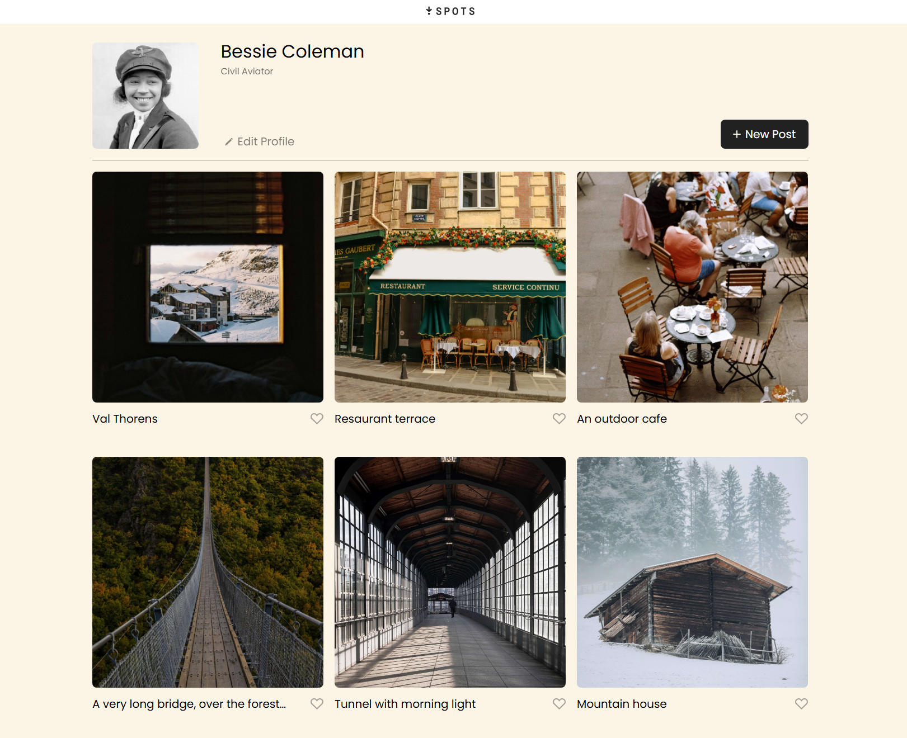
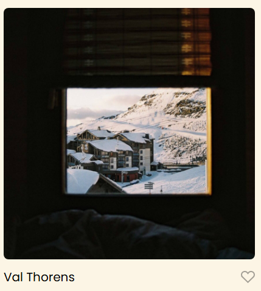
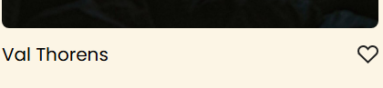

# Project 3: Spots

## Description

**Spots** is a responsive photo-sharing app that works seamlessly on both desktop and mobile devices. Users can share photos on their profile, send them to followers, and choose whether to display them publicly or privately. Friends can like images, and each user can personalize their profile with a profile picture, name, and description.

## Functionality

- Add and remove images from your profile
- Like and unlike posts
- Add profile information (name, description, profile picture)
- Responsive design that adapts across devices (desktop, tablet, mobile)
- Organized using BEM methodology for maintainable code

## Technologies & Techniques

- HTML5 for semantic structure
- CSS3 for styling
- Flexbox and CSS Grid for layout
- Media Queries for responsive design
- BEM principles for clean and scalable code organization

---

- [Link to the project on Figma](https://www.figma.com/file/BBNm2bC3lj8QQMHlnqRsga/Sprint-3-Project-%E2%80%94-Spots?type=design&node-id=2%3A60&mode=design&t=afgNFybdorZO6cQo-1)

**Images**

### Homepage

Shows the main photo feed where users can view shared images.  

### Profile Page

Users can add a profile picture, name, and description.  

Includes hover effects for buttons for artistic flare

### Images and likes

Users can view others pictures and view the name of the images.

People can also like the photos with hover effects.

### Responsive Mobile View

The layout adapts for mobile screens using media queries.  

[Link to the Github page](https://github.com/kianmorehead11/se_project_spots)
